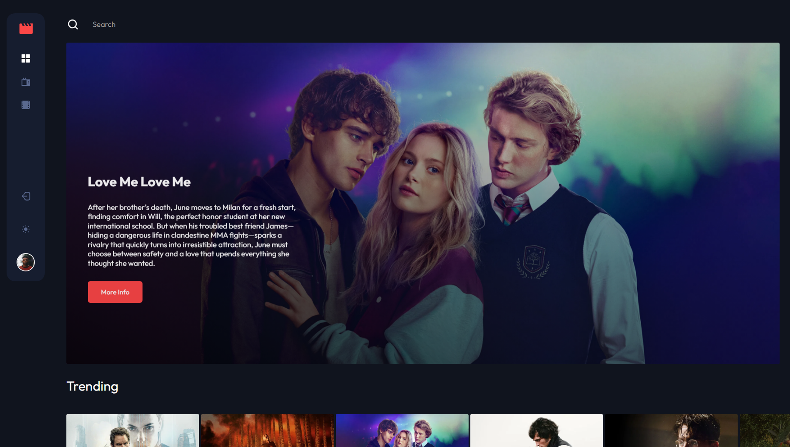
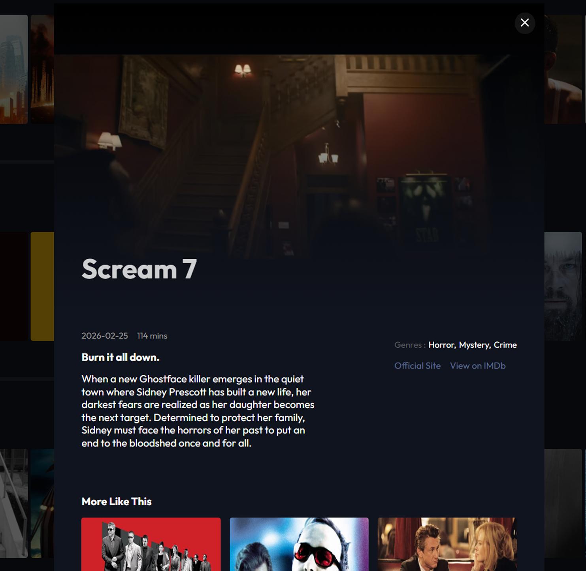
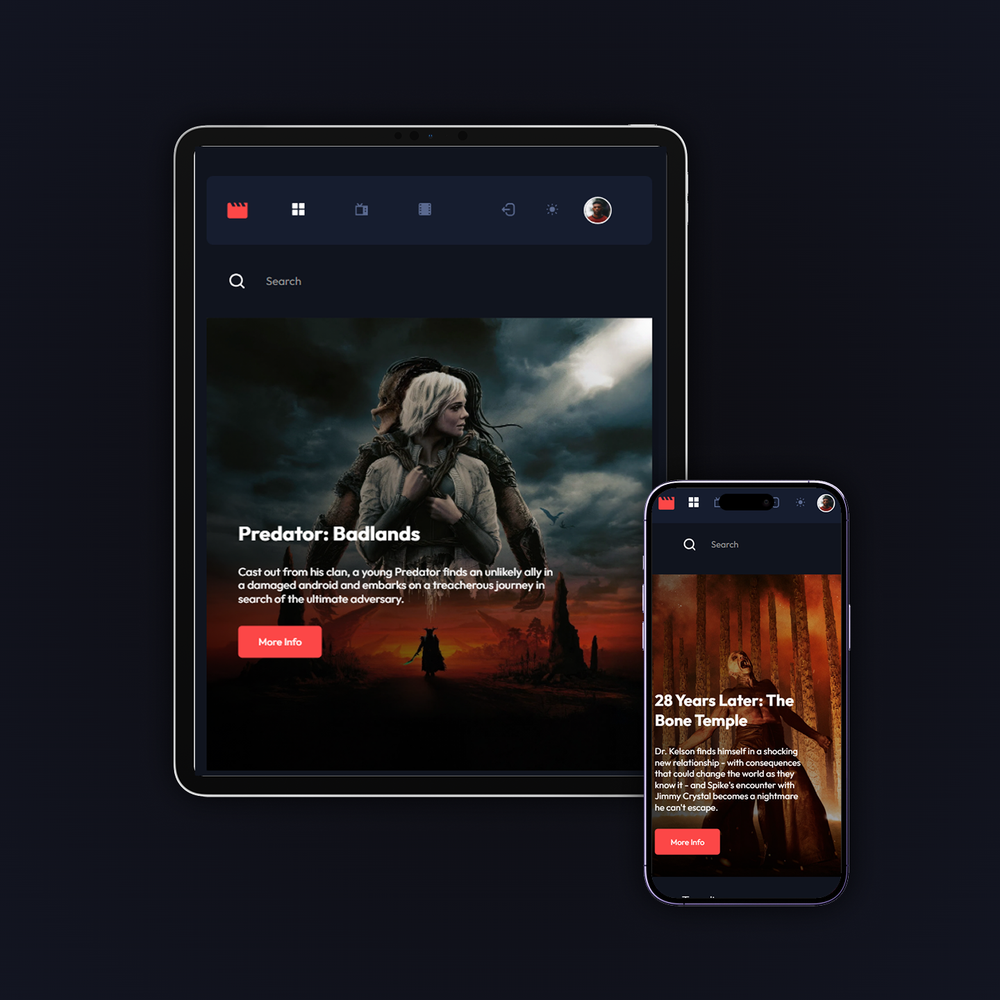

# CineFlow


## Overview

CineFlow is a Netflix-inspired movie discovery platform built with React, designed to replicate a modern streaming experience with real-time interactivity and smooth UI transitions. The goal of the project was to explore advanced React patterns, API integration, and dynamic UI behaviour in a real-world styled application.

## Live Demo

🔗 [Live Site](https://mscineflow.netlify.app/) · [GitHub Repo]([https://github.com/MoSu1248/your-repo](https://github.com/MoSu1248/Entertainment-app))

## Built With

- React
- JavaScript
- SCSS
- Zustand
- Firebase / Firestore
- Framer Motion
- Vite

## Features

-Netflix-inspired movie browsing experience built with React
-Real-time search and filtering across categorized movie content
-Interactive hover cards with instant trailer previews
-Dynamic modal view with full trailer playback + movie details
-“Similar movies” suggestions for deeper discovery
-Authentication system (login & registration flows)
-Live movie data integration via external APIs
-Global state management for smooth dynamic UI updates
-Fully responsive design optimized for all screen sizes
-Modern streaming-platform UI/UX inspired by Netflix

## Getting Started

```bash
# Clone the repo
git clone https://github.com/MoSu1248/your-repo.git

# Install dependencies
npm install

# Run locally
npm run dev
```

## Screenshots




## Author

Mohammed Suhail Rahman · [Portfolio](https://mscreatdev.netlify.app/) · [GitHub](https://github.com/MoSu1248)
